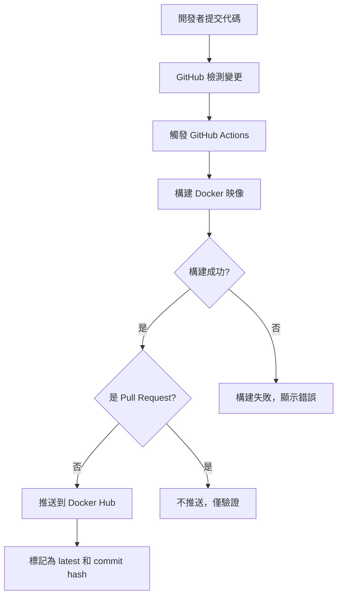

# 2025cloud Docker 專案

這是一個為了完成課程作業而創建的專案，展示如何使用 Docker 和 GitHub Actions 來自動化構建和部署容器映像。

## 打包應用程式

使用以下指令打包應用程式：

```bash
docker build -t yourusername/2025cloud:v1.0 .
```

## 運行容器

使用以下指令運行容器：

```bash
docker run -p 8080:80 yourusername/2025cloud:v1.0
```

運行後，可以在瀏覽器中訪問 http://localhost:8080 查看應用。

## 專案結構

- `Dockerfile`: 定義如何構建容器映像
- `web-app/`: 包含網頁應用程式文件
  - `index.html`: 主頁面
- `api/`: 包含 API 應用程式文件
  - `Dockerfile`: API 服務的構建定義
  - `app.js`: API 服務主程式
  - `package.json`: Node.js 依賴定義

## 自動化 Container Image 產生邏輯

本專案使用 GitHub Actions 實現自動化 Docker 映像的構建和發布，具體流程如下：



1. 開發者提交代碼到 GitHub 倉庫
2. GitHub Actions 檢測到變更時自動觸發
3. 構建 Docker 映像
4. 如果構建成功且不是 Pull Request，則推送到 Docker Hub
5. 根據不同條件（代碼路徑）構建不同的映像（網頁或 API）

## Tag 選擇邏輯

本專案為 Docker 映像採用了以下標籤策略：

1. **latest**: 表示主分支上最新成功構建的映像
2. **[commit-hash]**: 每次提交都會產生一個基於 Git commit hash 的唯一標籤
3. **api-latest**: API 應用程式的最新版本
4. **api-[commit-hash]**: API 應用程式基於 Git commit hash 的特定版本

